<h1>JavaScript Basic Examples</h1>

<h2>Index</h2>

This is the login page. Both username and password are used as values, to make it easier to log in. If either the password or the username is wrong or has less than 3 characters, an error message will be displayed, and, if both credentials are correct, a welcoming message will appear and, after 2 seconds, the web will be running. The JavaScript documents linked to this page are "login.js", which manages the log in checking if the credentials are correct. The other fuctions called here are "indexedDBStart.js", that inicializes the database, and "indexedDBPut.js", which adds an element to the DB by the given username and password. This page and the subpages have been enhanced with Bootstrap 5.

- - - - - - - - - - - - - - - - - - - - - - - - - - - - - - - - - - - - - - - - - - - - - - - - - - - - - - - - - - - - - - - -

Esta es la página de inicio de sesión. El usuario y la contraseña están establecidos como value para hacer más fácil el inicio. Si la contraseña o el usuario es incorrecto o menor de 3 carácteres, un mensaje de error aparecerá, mientras que si estos son correctos, mostrará un mensaje de bienvenida y en 2 segundos, se mostrará el resto de la página. Los documentos JavaScript enlazados a esta página son "login.js", la cual controla el inicio de sesión comprobando si las credenciales son correctas. Las otras funciones invocadas aquí son "indexedDBStart.js", que inicializa la base de datos, y "indexedDBPut.js" la cual añade un elemento a la BBDD dados el usuario y la contraseña. Tanto esta página como las subpáginas han sido mejoradas con Bootstrap 5.

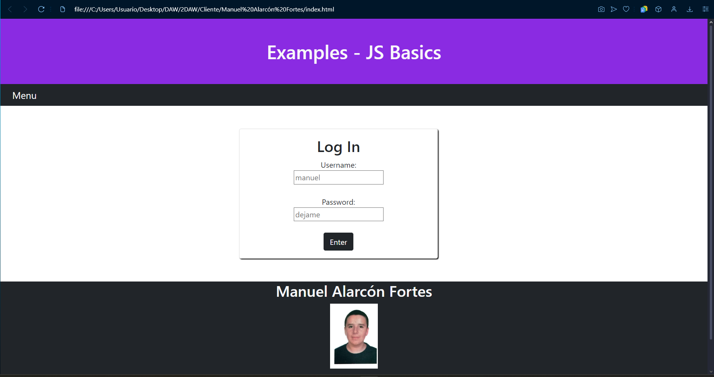

- - - - - - - - - - - - - - - - - - - - - - - - - - - - - - - - - - - - - - - - - - - - - - - - - - - - - - - - - - - - - - - -

- - - - - - - - - - - - - - - - - - - - - - - - - - - - - - - - - - - - - - - - - - - - - - - - - - - - - - - - - - - - - - - -

<h2>Main Page</h2>

In this page there are three cards with links for different exercises. There's a menu button that deploys a list of links, which is simbolized by an Bootstrap Icon. Those links are:"Repository", a link to this repository; "Number", which changes the page's contents to display the Number exercises; and "Log Out" which deletes the user's data and returns the user to the index page. The JavaScript documents linked to this page are "section.js" which changes the content of the page; "indexedDBCheck.js", which, everytime the page is loaded, checks if the element in the indexedDB exists and, if not, sends the user to the login page once again. Another function in this page is "indexedDBDelete.js", which deletes the data after clicking the log out button. The last JavaScript file linked here is "indexedDBStart.js", which calls the database so the other functions can be used.

- - - - - - - - - - - - - - - - - - - - - - - - - - - - - - - - - - - - - - - - - - - - - - - - - - - - - - - - - - - - - - - -

En esta página hay tres cards con enlaces a distintos ejercicios. Hay un botón de menú que despliega una lista de enlaces, simbolizado por un icono de Bootstrap. Estos enlaces son: "Repositorio", que es un enlace a este mismo repositorio; "Number", que cambia el contenido de la página para mostrar los ejercicios de Number; y finalmente "Log Out", el cual elimina los datos del usuario y envia al usuario a la página de index de nuevo. Los documentos de JavaScript enlazados a este documento son: "section.js", que cambia el contenido de la página; "indexedDBCheck.js", la cual comprueba que el elemento en el indexedDB existe, y si no, envia al usuario de nuevo a la pagina de inicio cada vez que se carga la página. Otra función usada aqui es "indexedDBDelete.js", que elimina los datos tras pulsar el botón "Log Out". Finalmente, el último archivo JavaScript enlazado aqui es "indexedDBStart.js", que llama a la base de datos para que las funciones previas puedan ser usadas.

- - - - - - - - - - - - - - - - - - - - - - - - - - - - - - - - - - - - - - - - - - - - - - - - - - - - - - - - - - - - - - - -

- - - - - - - - - - - - - - - - - - - - - - - - - - - - - - - - - - - - - - - - - - - - - - - - - - - - - - - - - - - - - - - -

<h2>Number</h2>

These exercises consist of number manipulation, with 2 exercises: a mini-calculator and a base converter.

- - - - - - - - - - - - - - - - - - - - - - - - - - - - - - - - - - - - - - - - - - - - - - - - - - - - - - - - - - - - - - - -

Estos ejercicios consisten en la manipulacion de números, con 2 ejercicios: una minicalculadora y un conversor de base.

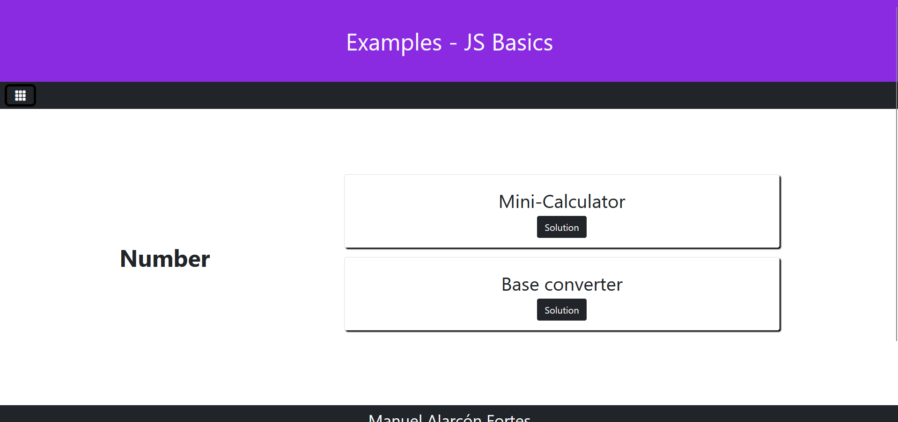

- - - - - - - - - - - - - - - - - - - - - - - - - - - - - - - - - - - - - - - - - - - - - - - - - - - - - - - - - - - - - - - -

- - - - - - - - - - - - - - - - - - - - - - - - - - - - - - - - - - - - - - - - - - - - - - - - - - - - - - - - - - - - - - - -

<h2>Mini-Calculator</h2>

This exercise consist of a calculator that recieves the variables thanks to two input fields and 9 buttons, assigned to different math symbols. The operations it is capable of making are adding, substracting, multiplying, dividing, taking both decimal or integer part, doing the factorial, doing the square root or elevating numbers. One of the linked JavaScript documents is "math.js", which take the values of the input fields and does the indicated operations. If the operation requires both fields but the second one is empty, it returns a message tellng that no data is provided. In case of entering non-number data, which is imposible due to the input being type number, it returns that a wrong format character was introduced. The other JavaScript document is "solution.js", which is the one that displays the messages, both solutions and errors. On the navbar, there is a bootstrap arrow icon that sends the user to the main page.

- - - - - - - - - - - - - - - - - - - - - - - - - - - - - - - - - - - - - - - - - - - - - - - - - - - - - - - - - - - - - - - -

Este ejercicio consiste en una calculadora que recibe las variables por medio de dos campos de input y 9 botones, asignadas a diferentes simbolos matemáticos. Las  operaciones que puede hacer son suma, resta,multiplicación, división, tomar la parte decimal o la parte entera, hacer el factorial, la raiz cuadrada o elevar numeros. Uno de los documentos enlazados es "math.js", el cual toma los valores de los input y hace la operacion indicada. Si la operacion requiere los dos campos y uno de ellos está vacío, devuelve que no se han suministrado datos. Si un carácter no numerico es introducido, lo cual, en principio es imposible por que el tipo de los inputs es number, devolverá un mensaje diciendo que se introdujo un dato en un formato incorrecto. El otro documento de js es "solution.js", el cual se encarga de mostrar los mensajes, tanto soluciones como errores. En la navbar, hay un icono de una flecha de bootstrap que envia al usuario a la página principal.

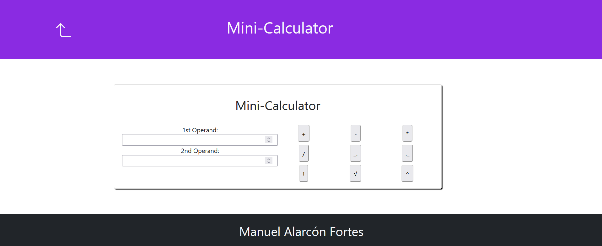

- - - - - - - - - - - - - - - - - - - - - - - - - - - - - - - - - - - - - - - - - - - - - - - - - - - - - - - - - - - - - - - -

- - - - - - - - - - - - - - - - - - - - - - - - - - - - - - - - - - - - - - - - - - - - - - - - - - - - - - - - - - - - - - - -

<h2>Base Conversor</h2>

This exercise consist of a base convertor that recieves the variable thanks to a input fields and 3 buttons, assigned to different bases. Depending on the base of the button clicked, the number introduced in the field will converted and displayed under the input. The JavaScript document linked here is "converter.js", which is converts and shows the result, both solutions and errors. "solution.js" was not used here because I wanted to give a more descriptive solution here. On the navbar, there is a bootstrap arrow icon that sends the user to the main page.

- - - - - - - - - - - - - - - - - - - - - - - - - - - - - - - - - - - - - - - - - - - - - - - - - - - - - - - - - - - - - - - -

Este ejercicio consiste en un conversor de base que recibe las variables por medio de un campo de input y 3 botones, asignadas a diferentes bases. Dependiendo de la base del botón clicado, el número introducido en el campo será convertido y mostrado debajo de este. El documento de JavaScript enlazado es "converter.js", el cual convierte y enseña el resultado, tanto soluciones como errores. No se usa "solution.js" en este documento debido a que queria dar un mensaje de solucion mas descriptiva. En la navbar, hay un icono de una flecha de bootstrap que envia al usuario a la página principal.

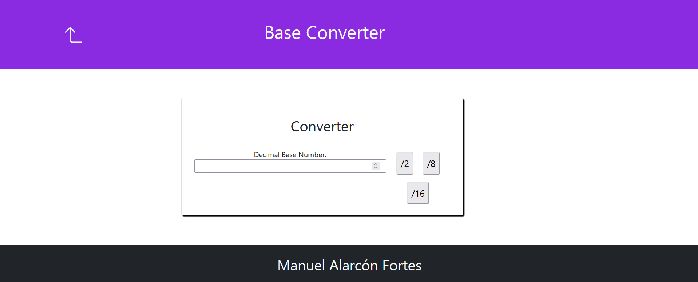

- - - - - - - - - - - - - - - - - - - - - - - - - - - - - - - - - - - - - - - - - - - - - - - - - - - - - - - - - - - - - - - -

- - - - - - - - - - - - - - - - - - - - - - - - - - - - - - - - - - - - - - - - - - - - - - - - - - - - - - - - - - - - - - - -

<h2>String</h2>

This exercise consist of string manipulation.

- - - - - - - - - - - - - - - - - - - - - - - - - - - - - - - - - - - - - - - - - - - - - - - - - - - - - - - - - - - - - - - -

Este ejercicio consisten en la manipulacion de string.

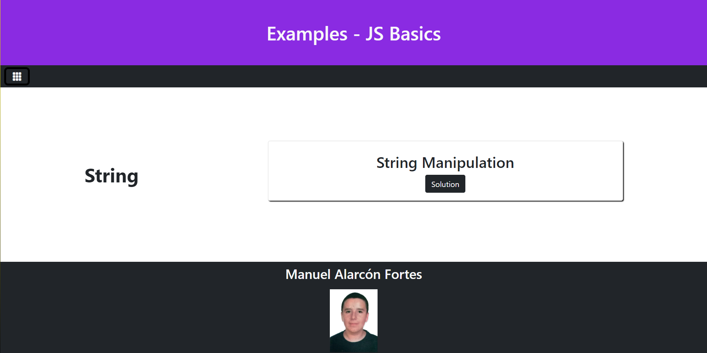

- - - - - - - - - - - - - - - - - - - - - - - - - - - - - - - - - - - - - - - - - - - - - - - - - - - - - - - - - - - - - - - -

- - - - - - - - - - - - - - - - - - - - - - - - - - - - - - - - - - - - - - - - - - - - - - - - - - - - - - - - - - - - - - - -

<h2>String Manipulator</h2>

This exercise consists of a textarea, where the text can be introduced and a group of 10 string changing buttons, 4 buttons for random inputs, a button which loads content from an IMDB Web API and the last button shows the movie poster. The JavaScript files linked to this page are "upper.js" which contains all upper case related functions, and "lower.js" which does so with lower case functions. Then "manip.js" manages which function is called and "generate.js" generates a random number which evokes a different function in "manip.js". The last two functions are API related. "movieAPI.js" gets data from a IMDB API and displays it in the textarea. "imgDisplay.js", shows the movie poster loaded from the API.

- - - - - - - - - - - - - - - - - - - - - - - - - - - - - - - - - - - - - - - - - - - - - - - - - - - - - - - - - - - - - - - -

Este ejercicio está constituido por un textarea, donde se puede introducir el texto a manipular y un grupo de 10 botones que modifican el string, 4 para la generación aleatoria del cambios, un boton que genera contenido sacado de una API Web de IMDB y el ultimo botón, que muestra el poster de la película. Los archivos JavaScript enlazados a esta página son "upper.js" que recoge todas las funciones relacionadas con las mayúsculas, y "lower.js", que hace lo propio con las minúsculas. "manip.js" controla la funcion que es llamada y "generate.js" se ocupa de generar numeros aleatorios que invocan funciones distintas en "manip.js". Las dos ultimas funciones estan relacionadas con la API. "movieAPI.js" recoge datos de una API de IMDB y lo muestra en el textarea. "imgDisplay.js", por su parte, muestra el poster de la pelicula cargada desde la API.

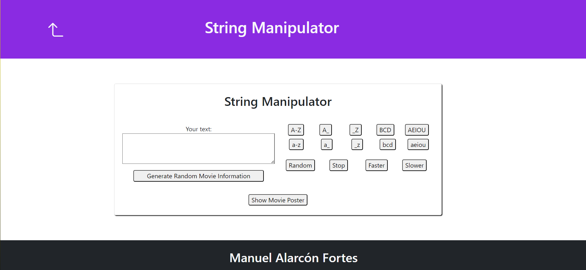

- - - - - - - - - - - - - - - - - - - - - - - - - - - - - - - - - - - - - - - - - - - - - - - - - - - - - - - - - - - - - - - -

- - - - - - - - - - - - - - - - - - - - - - - - - - - - - - - - - - - - - - - - - - - - - - - - - - - - - - - - - - - - - - - -

<h2>Array</h2>

This exercise consist of array manipulation.

- - - - - - - - - - - - - - - - - - - - - - - - - - - - - - - - - - - - - - - - - - - - - - - - - - - - - - - - - - - - - - - -

Este ejercicio consisten en la manipulacion de arrays.

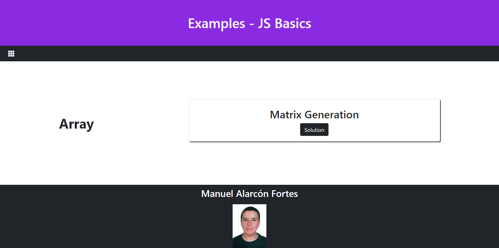

- - - - - - - - - - - - - - - - - - - - - - - - - - - - - - - - - - - - - - - - - - - - - - - - - - - - - - - - - - - - - - - -

- - - - - - - - - - - - - - - - - - - - - - - - - - - - - - - - - - - - - - - - - - - - - - - - - - - - - - - - - - - - - - - -

<h2>Matrix Generator</h2>

This exercise consists of a number input, where the size, minimum and maximum values of the array can be specified and a group of 9 buttons, consisting of 4 buttons for testing, 2 matrix creating button and 3 buttons for the arrays' math. The JavaScript files linked to this page are "matrixAB.js" which creates the first two matrixes by the values in the inputs, "matrixGen.js" which displays the matrix in the result section of the site, "matrixMath.js", which manage the matrix adding, substracting and multiplying, "matrixManip.js" which randomizes the matrix generation and "matrixTest.js", which sets the randomitation order.

- - - - - - - - - - - - - - - - - - - - - - - - - - - - - - - - - - - - - - - - - - - - - - - - - - - - - - - - - - - - - - - -

Este ejercicio está constituido por un input de tipo number, donde se puede introducir el tamaño, el valor mínimo y el valor máximo del array y un grupo de 9 botones, que son: 4 para el testeo, 2 botones que generan las dos primeras matrices y 3 botones para la matemática de las matrices. Los archivos JavaScript enlazados a esta página son "matrixAB.js" que crea la matriz dados los valores de los inputs, "matrixGen.js" que muestra la matriz en la sección de los resultados de la página, "matrixMath.js", que controla la suma, resta y multiplicación de arrays, "matrixManip.js" que aleatoriza la generación de arrays y "matrixTest.js", que establece el orden de la aleatorizacion.

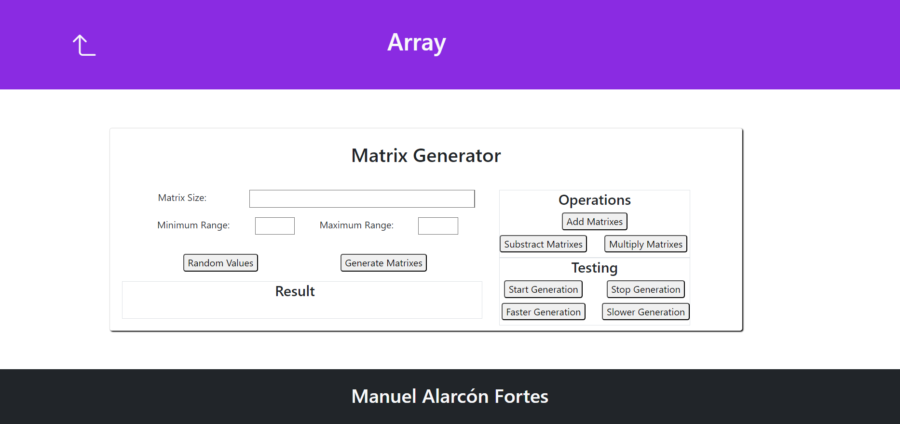

- - - - - - - - - - - - - - - - - - - - - - - - - - - - - - - - - - - - - - - - - - - - - - - - - - - - - - - - - - - - - - - -

- - - - - - - - - - - - - - - - - - - - - - - - - - - - - - - - - - - - - - - - - - - - - - - - - - - - - - - - - - - - - - - -

<h2>Storage</h2>

This exercise consist of diferent types of storage.

- - - - - - - - - - - - - - - - - - - - - - - - - - - - - - - - - - - - - - - - - - - - - - - - - - - - - - - - - - - - - - - -

Este ejercicio consisten en distintos tipos de almacenaje.

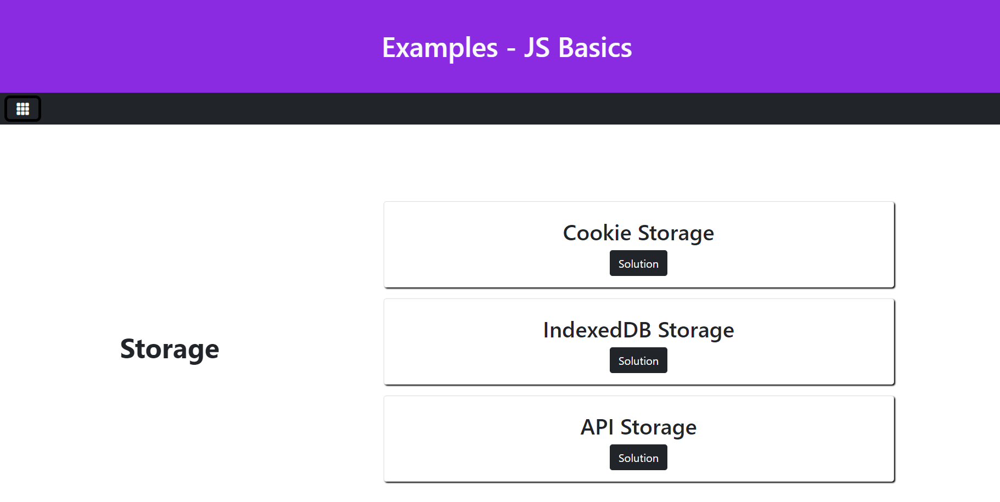

- - - - - - - - - - - - - - - - - - - - - - - - - - - - - - - - - - - - - - - - - - - - - - - - - - - - - - - - - - - - - - - -

- - - - - - - - - - - - - - - - - - - - - - - - - - - - - - - - - - - - - - - - - - - - - - - - - - - - - - - - - - - - - - - -

<h2>Cookie Storage</h2>

This exercise consists of 2 input fields, where the name and surname of the user can be specified and a button, which sends the data to the table below. The JavaScript files linked to this page are "uploadData.js" which recieves values in the inputs, sending them to "saveData.js" which adds them to the Cookie Storage. "showData.js" displays the content in the table, which contains a delete button that calls "deleteData.js" which deletes the element by the given name and a update button which calls "updateData.js".

- - - - - - - - - - - - - - - - - - - - - - - - - - - - - - - - - - - - - - - - - - - - - - - - - - - - - - - - - - - - - - - -

Este ejercicio está constituido por dos imputs, siendo donde se introducen el nombre y apellidos del usuario y un botón, que envia los valores a la tabla inferior. Los enlaces de JavaScript son de "uploadData.js", que recine los valores de los inputs y los manda a "saveData.js" que añade el elemento al almacenamiento de Cookie. "showData.js" muestra el contenido de la tabla, el cual contiene un boton de eliminar que llama a "deleteData.js", que lo elimina por el nombre dado y un boton para actualizar que llama a "updateData.js".

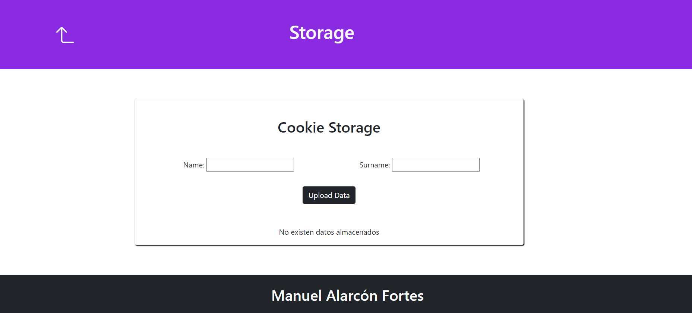

- - - - - - - - - - - - - - - - - - - - - - - - - - - - - - - - - - - - - - - - - - - - - - - - - - - - - - - - - - - - - - - -

- - - - - - - - - - - - - - - - - - - - - - - - - - - - - - - - - - - - - - - - - - - - - - - - - - - - - - - - - - - - - - - -

<h2>Session Storage</h2>

This exercise consists of 3 input fields, where the name, surname and age of the user can be specified and a button, which sends the data to the table below. The JavaScript files linked to this page are "uploadData.js" which recieves values in the inputs, sending them to "saveData.js" which adds them to the SessionStorage. "showData.js" displays the content in the table, which contains a delete button that calls "deleteData.js" which deletes the element by the given name and a update button which calls "updateData.js".

- - - - - - - - - - - - - - - - - - - - - - - - - - - - - - - - - - - - - - - - - - - - - - - - - - - - - - - - - - - - - - - -

Este ejercicio está constituido por tres imputs, siendo donde se introducen el nombre, apellidos y edad del usuario y un botón, que envia los valores a la tabla inferior. Los enlaces de JavaScript son de "uploadData.js", que recine los valores de los inputs y los manda a "saveData.js" que añade el elemento al SessionStorage. "showData.js" muestra el contenido de la tabla, el cual contiene un boton de eliminad que llama a "deleteData.js", que lo elimina por el nombre dado y un boton para actualizar que llama a "updateData.js".

- - - - - - - - - - - - - - - - - - - - - - - - - - - - - - - - - - - - - - - - - - - - - - - - - - - - - - - - - - - - - - - -

- - - - - - - - - - - - - - - - - - - - - - - - - - - - - - - - - - - - - - - - - - - - - - - - - - - - - - - - - - - - - - - -

<h2>LocalStorage + PokeAPI</h2>

This exercise consists of 5 input fields for Pokedex Number, Pokemon Name, the types and the url for their image. There is a button to send the data and 2 buttons, which especifies the amount of Pokemon added to the table below via API. The JavaScript files linked to this page are "uploadData.js" which recieves the information from "recieveAPIData.js", which gets the information from PokeAPI, sending them to "saveData.js" which adds them to the localStorage. "showData.js" displays the content in the table, which contains a delete button that calls "deleteData.js" which deletes the element by the given name and a update button which calls "updateData.js".

- - - - - - - - - - - - - - - - - - - - - - - - - - - - - - - - - - - - - - - - - - - - - - - - - - - - - - - - - - - - - - - -

Este ejercicio está constituido por 5 campos de input: Numero de la Pokedex, Nombre del Pokemon, los tipos y la url de la imagen de estos. También hay un botón para subir los datos y otros dos botones, que especifica la cantidad de Pokemons añadidos a la tabla inferior vía API. Los enlaces de JavaScript son de "uploadData.js", que recibe los valores de "recieveAPIData.js"  que recoge la informacion de la PokeAPI y los manda a "saveData.js" que añade el elemento al localStorage. "showData.js" muestra el contenido de la tabla, el cual contiene un boton de eliminad que llama a "deleteData.js", que lo elimina por el nombre dado y un boton para actualizar que llama a "updateData.js".

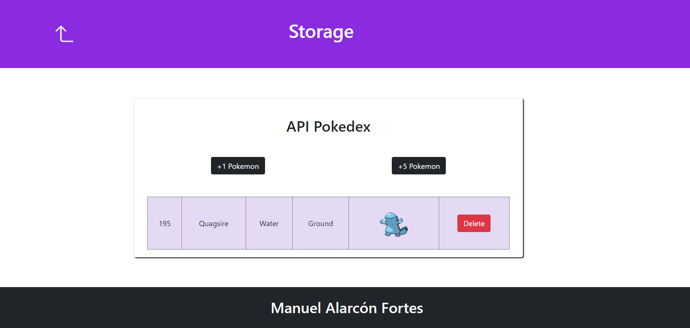

- - - - - - - - - - - - - - - - - - - - - - - - - - - - - - - - - - - - - - - - - - - - - - - - - - - - - - - - - - - - - - - -

- - - - - - - - - - - - - - - - - - - - - - - - - - - - - - - - - - - - - - - - - - - - - - - - - - - - - - - - - - - - - - - -

<h2>IndexedDB + StarWars</h2>

This exercise consists of 3 input fields for name, homeworld and species. There is a button to send the data and 2 buttons, which especifies the amount of Characters added to the table below via API. The JavaScript files linked to this page are "uploadData.js" which recieves the information from "recieveAPIData.js", which gets the information from SWAPI(Star Wars API), sending them to "saveData.js" which adds them to the IndexedDB. "showData.js" displays the content in the table, which contains a delete button that calls "deleteData.js" which deletes the element by the given name and a update button which calls "updateData.js".

- - - - - - - - - - - - - - - - - - - - - - - - - - - - - - - - - - - - - - - - - - - - - - - - - - - - - - - - - - - - - - - -

Este ejercicio está constituido por 3 campos de input: nombre, planeta de origen y especie. También hay un botón para subir los datos y otros dos botones, que especifica la cantidad de personajes añadidos a la tabla inferior vía API. Los enlaces de JavaScript son de "uploadData.js", que recibe los valores de "recieveAPIData.js"  que recoge la informacion de la SWAPI(Star Wars API) y los manda a "saveData.js" que añade el elemento a la IndexedDB. "showData.js" muestra el contenido de la tabla, el cual contiene un boton de eliminad que llama a "deleteData.js", que lo elimina por el nombre dado y un boton para actualizar que llama a "updateData.js".

