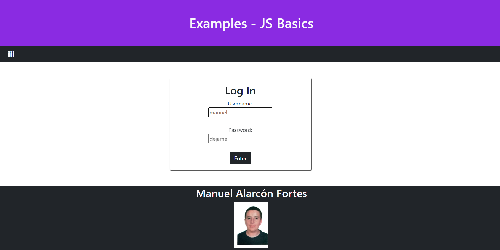

<h1>JavaScript Basic Examples</h1>

<h2>Main Page</h2>

In this page there are three cards with links for different examples. This page and the subpages have been enhanced with Bootstrap 5. Before being able to check the content, you have to log in. Both username and password are used as placeholders, to make it easier to log in. If either the password or the username is wrong or has less than 3 characters, an error message will be displayed, and, if both credentials are correct, a welcoming message will appear and, after 2 seconds, the web will be running.

- - - - - - - - - - - - - - - - - - - - - - - - - - - - - - - - - - - - - - - - - - - - - - - - - - - - - - - - - - - - - - - -

En esta página hay tres cards con enlaces a distintos ejemplos. Tanto esta página como las subpáginas han sido mejoradas con Bootstrap 5. Antes de poder ver el contenido, se debe iniciar sesión. El usuario y la contraseña están establecidos como placeholders para hacer más fácil el inicio. Si la contraseña o el usuario es incorrecto o menor de 3 carácteres, un mensaje de error aparecerá, mientras que si estos son correctos, mostrará un mensaje de bienvenida y en 2 segundos, se mostrará el resto de la página.

- - - - - - - - - - - - - - - - - - - - - - - - - - - - - - - - - - - - - - - - - - - - - - - - - - - - - - - - - - - - - - - -

- - - - - - - - - - - - - - - - - - - - - - - - - - - - - - - - - - - - - - - - - - - - - - - - - - - - - - - - - - - - - - - -

 There's a menu button that deploys a list of links. By the moment, the only existing link is the link to this repository. 

All these pages are responsive thanks to Bootstrap and its integrated functionalities.

- - - - - - - - - - - - - - - - - - - - - - - - - - - - - - - - - - - - - - - - - - - - - - - - - - - - - - - - - - - - - - - -

Hay un botón de menú que despliega una lista de enlaces. Por ahora, el único enlace existente es el enlace a este repositorio. 

Estas páginas son responsivas gracias a Bootstrap y a sus funcionalidades integradas.

- - - - - - - - - - - - - - - - - - - - - - - - - - - - - - - - - - - - - - - - - - - - - - - - - - - - - - - - - - - - - - - -

- - - - - - - - - - - - - - - - - - - - - - - - - - - - - - - - - - - - - - - - - - - - - - - - - - - - - - - - - - - - - - - -

<h2>First and Second example</h2>

This page contains a button which, when pressed, changes the text below, saying that it's the exercise's solution. It works in a refactored way, which makes it easier to reuse the code in the future.

- - - - - - - - - - - - - - - - - - - - - - - - - - - - - - - - - - - - - - - - - - - - - - - - - - - - - - - - - - - - - - - -

Esta página contiene un botón, que cuando es pulsado, cambia el texto inferior, sustituyéndolo por uno que dice que es la solución de este ejercicio. Es un código refactorizado que facilita su utilización en el futuro.

