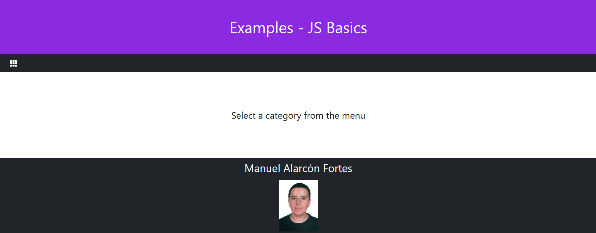

<h1>JavaScript Basic Examples</h1>

<h2>Index</h2>

This is the login page. Both username and password are used as values, to make it easier to log in. If either the password or the username is wrong or has less than 3 characters, an error message will be displayed, and, if both credentials are correct, a welcoming message will appear and, after 2 seconds, the web will be running. The JavaScript documents linked to this page are "login.js", which manages the log in checking if the credentials are correct. The other fuction called here is "setCookie.js", which creates the cookie by the given username and password. This page and the subpages have been enhanced with Bootstrap 5.

- - - - - - - - - - - - - - - - - - - - - - - - - - - - - - - - - - - - - - - - - - - - - - - - - - - - - - - - - - - - - - - -

Esta es la página de inicio de sesión. El usuario y la contraseña están establecidos como value para hacer más fácil el inicio. Si la contraseña o el usuario es incorrecto o menor de 3 carácteres, un mensaje de error aparecerá, mientras que si estos son correctos, mostrará un mensaje de bienvenida y en 2 segundos, se mostrará el resto de la página. Los documentos JavaScript enlazados a esta página son "login.js", la cual controla el inicio de sesión comprobando si las credenciales son correctas. La otra funcion invocada aquí es "setCookie.js", la cual crea la cookie dados el usuario y la contraseña. Tanto esta página como las subpáginas han sido mejoradas con Bootstrap 5.

- - - - - - - - - - - - - - - - - - - - - - - - - - - - - - - - - - - - - - - - - - - - - - - - - - - - - - - - - - - - - - - -

- - - - - - - - - - - - - - - - - - - - - - - - - - - - - - - - - - - - - - - - - - - - - - - - - - - - - - - - - - - - - - - -

<h2>Main Page</h2>

In this page there are three cards with links for different exercises. There's a menu button that deploys a list of links, which is simbolized by an Bootstrap Icon. Those links are:"Repository", a link to this repository; "Number", which changes the page's contents to display the Number exercises; and "Log Out" which deletes the cookie and returns the user to the index page. The JavaScript documents linked to this page are "section.js" which changes the content of the page; "checkCookie.js", which, everytime the page is loaded, checks if the cookie exists and, if not, sends the user to the login page one again. The last fuction in this page is "eraseCookie.js", which deletes the cookie after clicking the log out button.

- - - - - - - - - - - - - - - - - - - - - - - - - - - - - - - - - - - - - - - - - - - - - - - - - - - - - - - - - - - - - - - -

En esta página hay tres cards con enlaces a distintos ejercicios. Hay un botón de menú que despliega una lista de enlaces, simbolizado por un icono de Bootstrap. Estos enlaces son: "Repositorio", que es un enlace a este mismo repositorio; "Number", que cambia el contenido de la página para mostrar los ejercicios de Number; y finalmente "Log Out", el cual elimina la cookie y envia al usuario a la página de index de nuevo. Los documentos de JavaScript enlazados a este documento son: "section.js", que cambia el contenido de la página; "checkCookie.js", la cual comprueba que la cookie existe, y si no, envia al usuario de nuevo a la pagina de inicio cada vez que se carga la página. La última función es "eraseCookie.js", que elimina la cookie tras pulsar el botón "Log Out".

- - - - - - - - - - - - - - - - - - - - - - - - - - - - - - - - - - - - - - - - - - - - - - - - - - - - - - - - - - - - - - - -

- - - - - - - - - - - - - - - - - - - - - - - - - - - - - - - - - - - - - - - - - - - - - - - - - - - - - - - - - - - - - - - -

<h2>Number</h2>

These exercises consist of number manipulation, with 2 exercises: a mini-calculator and a base converter.

- - - - - - - - - - - - - - - - - - - - - - - - - - - - - - - - - - - - - - - - - - - - - - - - - - - - - - - - - - - - - - - -

Estos ejercicios consisten en la manipulacion de números, con 2 ejercicios: una minicalculadora y un conversor de base.

- - - - - - - - - - - - - - - - - - - - - - - - - - - - - - - - - - - - - - - - - - - - - - - - - - - - - - - - - - - - - - - -

- - - - - - - - - - - - - - - - - - - - - - - - - - - - - - - - - - - - - - - - - - - - - - - - - - - - - - - - - - - - - - - -

<h2>Mini-Calculator</h2>

This exercise consist of a calculator that recieves the variables thanks to two input fields and 9 buttons, assigned to different math symbols. The operations it is capable of making are adding, substracting, multiplying, dividing, taking both decimal or integer part, doing the factorial, doing the square root or elevating numbers. One of the linked JavaScript documents is "math.js", which take the values of the input fields and does the indicated operations. If the operation requires both fields but the second one is empty, it returns a message tellng that no data is provided. In case of entering non-number data, which is imposible due to the input being type number, it returns that a wrong format character was introduced. The other JavaScript document is "solution.js", which is the one that displays the messages, both solutions and errors. On the navbar, there is a bootstrap arrow icon that sends the user to the main page.

- - - - - - - - - - - - - - - - - - - - - - - - - - - - - - - - - - - - - - - - - - - - - - - - - - - - - - - - - - - - - - - -

Este ejercicio consiste en una calculadora que recibe las variables por medio de dos campos de input y 9 botones, asignadas a diferentes simbolos matemáticos. Las  operaciones que puede hacer son suma, resta,multiplicación, división, tomar la parte decimal o la parte entera, hacer el factorial, la raiz cuadrada o elevar numeros. Uno de los documentos enlazados es "math.js", el cual toma los valores de los input y hace la operacion indicada. Si la operacion requiere los dos campos y uno de ellos está vacío, devuelve que no se han suministrado datos. Si un carácter no numerico es introducido, lo cual, en principio es imposible por que el tipo de los inputs es number, devolverá un mensaje diciendo que se introdujo un dato en un formato incorrecto. El otro documento de js es "solution.js", el cual se encarga de mostrar los mensajes, tanto soluciones como errores. En la navbar, hay un icono de una flecha de bootstrap que envia al usuario a la página principal.

- - - - - - - - - - - - - - - - - - - - - - - - - - - - - - - - - - - - - - - - - - - - - - - - - - - - - - - - - - - - - - - -

- - - - - - - - - - - - - - - - - - - - - - - - - - - - - - - - - - - - - - - - - - - - - - - - - - - - - - - - - - - - - - - -

<h2>Base Conversor</h2>

This exercise consist of a base convertor that recieves the variable thanks to a input fields and 3 buttons, assigned to different bases. Depending on the base of the button clicked, the number introduced in the field will converted and displayed under the input. The JavaScript document linked here is "converter.js", which is converts and shows the result, both solutions and errors. "solution.js" was not used here because I wanted to give a more descriptive solution here. On the navbar, there is a bootstrap arrow icon that sends the user to the main page.

- - - - - - - - - - - - - - - - - - - - - - - - - - - - - - - - - - - - - - - - - - - - - - - - - - - - - - - - - - - - - - - -

Este ejercicio consiste en un conversor de base que recibe las variables por medio de un campo de input y 3 botones, asignadas a diferentes bases. Dependiendo de la base del botón clicado, el número introducido en el campo será convertido y mostrado debajo de este. El documento de JavaScript enlazado es "converter.js", el cual convierte y enseña el resultado, tanto soluciones como errores. No se usa "solution.js" en este documento debido a que queria dar un mensaje de solucion mas descriptiva. En la navbar, hay un icono de una flecha de bootstrap que envia al usuario a la página principal.

